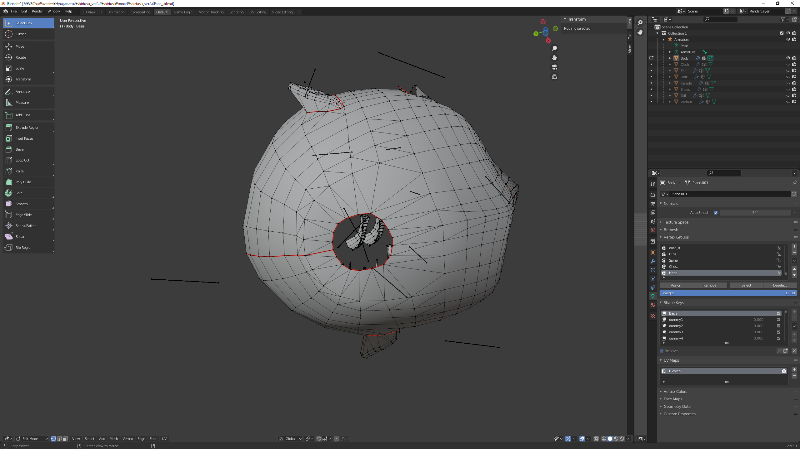
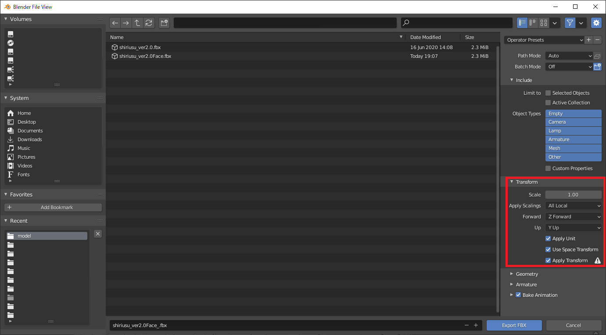
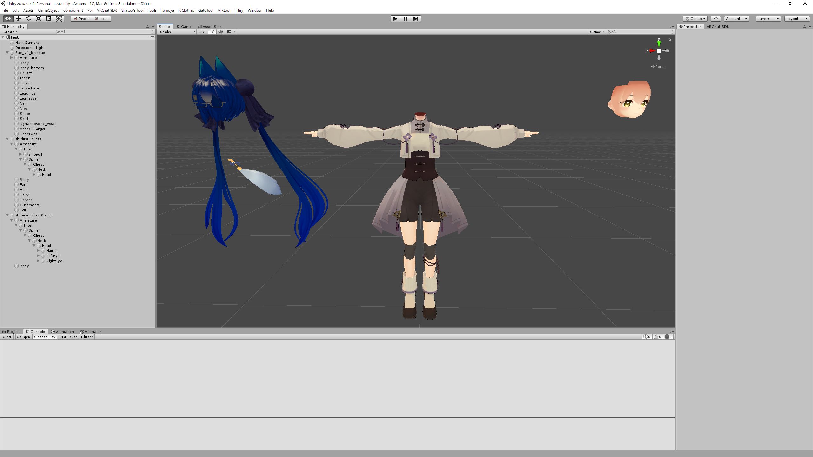

# 

## Blenderでの作業

Blenderを使用してシリウスちゃんの首の付け根の開いた部分を小さくします。作業前が図1-1、作業後が図1-2です。私は手抜きで頂点を移動させただけです。頑張って編集モードで移動してください。図1-3のようにミラーを入れておくと左右一緒に移動させられるので楽です

図1-1 作業前

図1-2 作業後

図1-3 ミラー設定

FileメニューからExport、FBXを選択して出力先を指定します。このときTransformのオプションを図のように変更します(図1-4)。もしかしたらApplySettingsはAll Localかもしれない。上手く行かなかったら変えてみてください。

図1-4 エクスポート

## Unityでの作業

### マテリアル設定

Blenderで出力したFBXファイルをUnityにインポートします。おそらく全部灰色になっていると思うのでいつものシリウスちゃんのマテリアルを(コピーして)指定してやります。最後にApplyを押して適用します。

図2-1 マテリアル設定

### 移植作業

移植をします。[VRChatアバター改変：頭部の移植](https://note.com/kaziya21/n/n79dd8ad69f3c)の記事がベースです。

今回は既存のFBXを置き換えるのが怖いので、顔のメッシュ(Body)だけとそれ以外のシリウスちゃんのオブジェクト、透羽ちゃんのオブジェクトの3つをあわせます。体の大半を占める透羽ちゃんをアバターのベースとして使用します。

#### 手順1~2

記事のとおりに行います。

#### 手順3

この手順では透羽ちゃんのボーンとメッシュはは削除せずにおいておきます。作業後の参考が図2-2です。またそれぞれのトランスフォームの参考を図2-3,図2-4,図2-5に示します。

図2-2 オブジェクト構成

図2-3 透羽ちゃん詳細

図2-4 シリウスちゃん(顔以外)詳細

図2-5 シリウスちゃん(顔)詳細

#### 手順4

この時点でのシーンファイルをバックアップしておきましょう。

ここまで来るとあとは専用服の着せ替えと同じです。着せ替えツールで合成すると楽だと思います。私はAvatarSkinReplaceをよく使っていますが、これを使用する際にはオートポジションと自動サイズのチェックを外します。これを外さないとAvatar側の位置やサイズに合わせて調整されてしまいます。

図2-6 AvatarSkinReplace設定

AvatarSkinReplaceでの結合作業ではArmature以下のオブジェクトに入れていたものが外に出てくることがあるかも知れないのでその場合は正しい位置に戻します。

図2-7 外に出されたオブジェクト

#### 手順5

透羽ちゃんとシリウスちゃんのシェーダーはどちらもUnityChanToonShader/Toon_DoubleShadeWithFeatherなのでシェーダーで上手く合わせるかテクスチャの色をあわせる必要があります。まだやってないのでよしなにしてください。

#### 手順6

基本的に記事の手順通りです。

図2-8のようにFaceMeshがNoneになっているのでシリウスちゃんの顔のメッシュを指定してあげます。指定後visemeの項目が出てくるので正しく指定してあげてください。設定後が図2-9です。

図2-8 LipSync設定前

図2-9 LipSync設定後

#### 手順7の前に

この手順の作成のために着替え用のプレハブで無効化されている服を再度有効化して使用していたのですが、これをそのままアップロードするとプレビューでは服が表示されているのに実際に読み込むと何も服が表示されなくなってしまったので気をつけましょう。

#### 手順7

アップロードして確認しましょう！まだVRで確認していないのでどの程度しっくり来るかは謎です。
